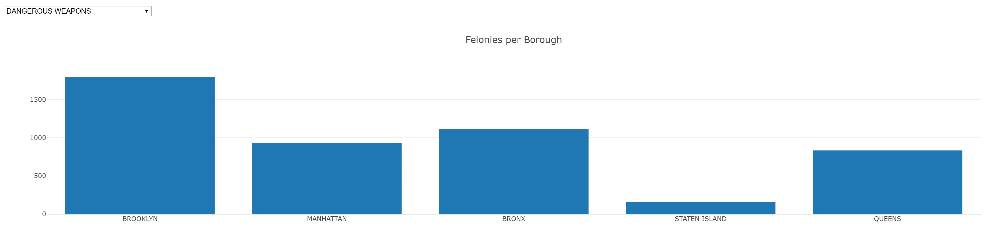

# Visualizing House Prices in Correlation to Housing code violations and crime statistics

How does crime in NYC correlate with lower/higher standards of living as it relates to housing code violations? Higher crime area suggest a lack of desirability in location and has greater potential of corrupt landlords and decrepit living situations. We are curious to visualize the correlation.

## Data Sources
### Housing Maintenance Code Violations
Pursuant to New York City’s Housing Maintenance Code, the Department of Housing Preservation and Development (HPD) issues violations against conditions in rental dwelling units that have been verified to violate the New York City using Maintenance Code (HMC) or the New York State Multiple Dwelling Law (MDL). Violations are issued when an inspection verifies that a violation of the HMC or MDL exists. It is closed when the violation is corrected, as observed/verified by HPD or as certified by the landlord.

### NYPD Complaint Data Historic
This dataset includes all valid felony, misdemeanor, and violation crimes reported to the New York City Police Department (NYPD) from 2006 to the end of last year (2017). For additional details, please see the attached data dictionary in the ‘About’ section.

### NYC Median Home Values
Median Household Income for 2010 Census Tracts in the RPA region including estimated breakdowns for transportation costs, housing costs, and income taxes.Last Updated: January 5, 2015

## Technologies Used
### Flask
Flask was used as the micro framework to build the dashboard and access the MySQL database

### Leaflet JS Library
The heatmap and chorpleth effects in our interactive maps on the dashboard were obtained from the leaflet librbary

### Plotly JS Libary
Plotly was used to create the bar charts outlining the major crimes in NYC boroughs

## Screenshots

Zooming into the map

Charts

## Conclusions

As expected, areas with more housing code violations implied a lower mean home value. This was very evident in the South Bronx, which is New Yorks poorest neighbourhood. It was interesting to note however that certain areas in Brooklyn, even with high concentrations of housing code violations continue to have very high home prices. This is most likely due to the ongoing trasnformation and gentrification of traditionally lower income areas of Brooklyn

